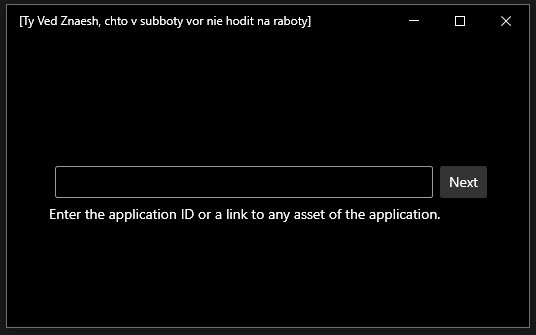
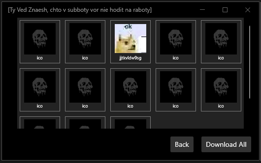

# gDiscordAppSpy -- Discord Assets Extractor

This application allows you to extract and view all assets (icons, images, etc.) from Discord applications. It provides an easy way to explore and download assets associated with any Discord application by entering its ID or asset link.

## Features
- Extract and view all assets of a Discord application.
- Simple and intuitive interface.
- Supports both application ID and direct asset links.

## How to Use
1. Enter the **Application ID** or a **link to any asset** of the Discord application.
2. The application will fetch and display all available assets.
3. You can view or download the assets directly.

## Screenshots
  

## Download
You can download the latest release of the application from the [Releases](https://github.com/GladiatorVS/gDiscordAppSpy/releases) section.

## Requirements
- .NET Framework 4.7.2 or later.
- Windows 10 or later.

## License
This project is licensed under the MIT License. See the [LICENSE](LICENSE) file for details.

---

Enjoy exploring Discord assets! 🚀
